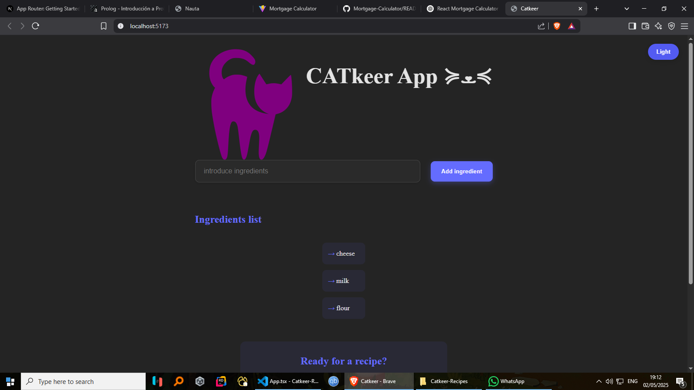

# 🍳 Recipe Generator

An AI-powered app that generates delicious recipes based on the ingredients you have at home. Just enter what you’ve got, and let the magic happen—powered by Hugging Face's NLP models.


---

## 📸 Preview

  
*(Optional: Add a preview image of your app)*

---

## 🧠 Features

- AI-generated recipes based on user-input ingredients
- Step-by-step cooking instructions
- Clean, responsive user interface
- Built with Vite for fast performance
- Easy environment config with `.env`

---

## How It Works ✨

1. **Enter Your Ingredients** – List what you have in your fridge/pantry.  
2. **Get AI-Generated Recipes** – Our Hugging Face model suggests creative dishes.  
3. **Cook & Enjoy!** – Follow the step-by-step instructions.

---

## 🛠 Tech Stack

- React + Vite
- CSS
- Hugging Face Inference API
- JavaScript (ES6+) / TypeScript

---

## 📦 Getting Started

### Prerequisites

- Node.js (>= 14)
- npm or yarn
- Hugging Face API Key

### Installation

```bash
git clone https://github.com/your-username/recipe-generator.git
cd recipe-generator
npm install


**NOTE** - If you want to use it you must get a hugging face API Key, then in the proyect folder create a .env file 
with the next code:

```VITE_APP_KEY= yourApiKey```

